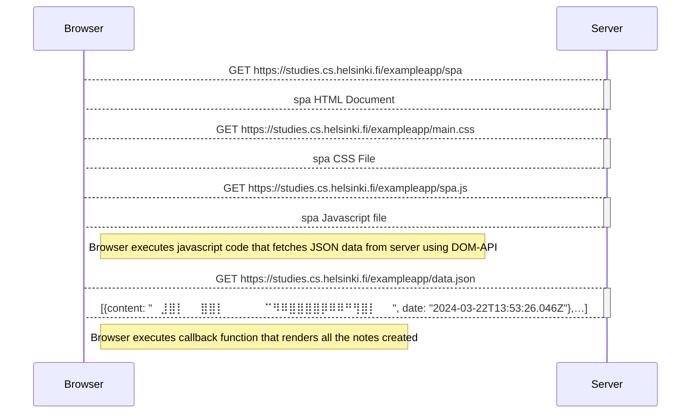

```mermaid
  sequenceDiagram
  participant Browser
  participant Server

  Browser --> Server: GET https://studies.cs.helsinki.fi/exampleapp/spa
  activate Server
  Server --> Browser: spa HTML Document
  deactivate Server

  Browser --> Server: GET https://studies.cs.helsinki.fi/exampleapp/main.css
  activate Server
  Server --> Browser: spa CSS File
  deactivate Server

  Browser --> Server: GET https://studies.cs.helsinki.fi/exampleapp/spa.js
  activate Server
  Server --> Browser: spa Javascript file
  deactivate Server

  Note right of Browser: Browser executes javascript code that fetches JSON data from server using DOM-API

  Browser --> Server: GET https://studies.cs.helsinki.fi/exampleapp/data.json
  activate Server
  Server --> Browser: [{content: "⠀⣸⣿⡇⠀⠀⣿⣿⡇⠀⠀⠀⠀⠀⠉⠻⠿⣿⣿⣿⣿⡿⠿⠿⠛⢻⣿⡇⠀⠀", date: "2024-03-22T13:53:26.046Z"},…]
  deactivate Server

  Note right of Browser: Browser executes callback function that renders all the notes created
```
