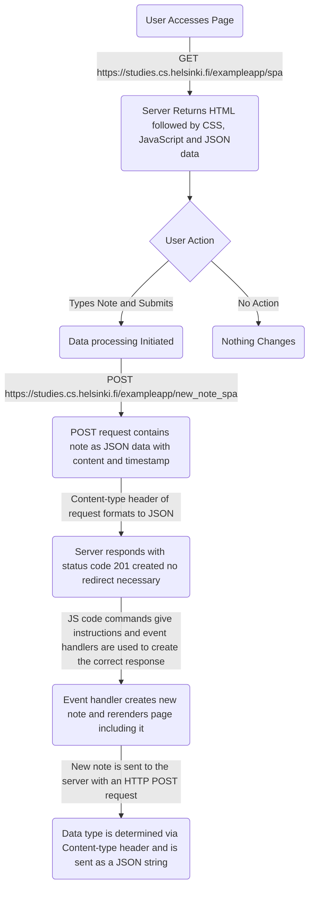

```mermaid
  flowchart TD
  A(User Accesses Page) -->|GET https://studies.cs.helsinki.fi/exampleapp/spa| B(Server Returns HTML followed by CSS, JavaScript and JSON    data);
  B --> C{User Action};
  C --> |Types Note and Submits| D(Data processing Initiated);
  C --> |No Action| E(Nothing Changes);
  D --> |POST https://studies.cs.helsinki.fi/exampleapp/new_note_spa| F(POST request contains note as JSON data with content and timestamp);
  F --> |Content-type header of request formats to JSON| G(Server responds with status code 201 created no redirect necessary);
  G --> |JS code commands give instructions and event handlers are used to create the correct response| H(Event handler creates new note and rerenders page including it);
  H--> |New note is sent to the server with an HTTP POST request| I(Data type is determined via Content-type header and is sent as a JSON string)
```
